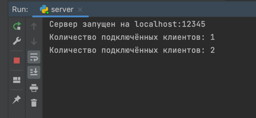
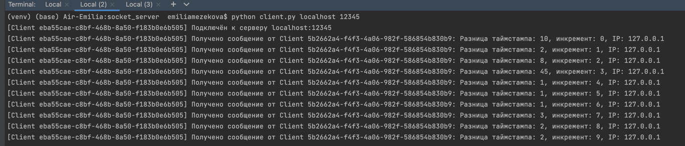

# Python Socket Server

## About project

This project is a simple multithreaded TCP server written in Python.
Also contains logic of client. 

### Server
The server listens for connections on a specified host and port, and for each new connection, 
it spawns a new thread to handle the communication with the client, inform developer when client is connected or disconnected.
Server recieve messages from clients and broadcast it to all others clients. 

### Client
Connect to server: port provided by user. Each client get unique id. 
Client every 1 second send json that contains id, timestamp and increment. Also receive simular json from
others clients and print it out if id and timestamp not the same. 

## How to Run

### 1. Clone the Repository
```
git clone https://github.com/Kannoken/socket_server
```
### 2. Run server
```
python server.py [host] [port]
```
- host (optional) - The host address where the server will run. Defaults to localhost.
- port (optional) - The port number the server will bind to. Defaults to 12345.

For example, to run the server on localhost with port 8080:

```
python server.py localhost 8080
```
If you want to just run with the default localhost:12345 configuration:
````
python server.py
````
#### Example of running server output


### 3. Connecting Clients
Once the server is running, you can connect clients to it.
```
python client.py [server_id] [server_port]
```
Host and port should be same as server. You should start at least 2 clients (for example in two terminals) to exchange messages between clients.

#### Example of 2 running clients

